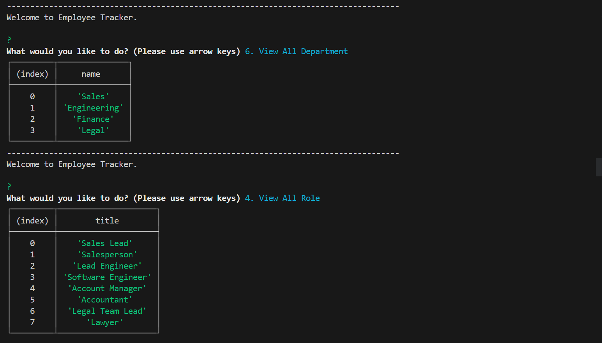
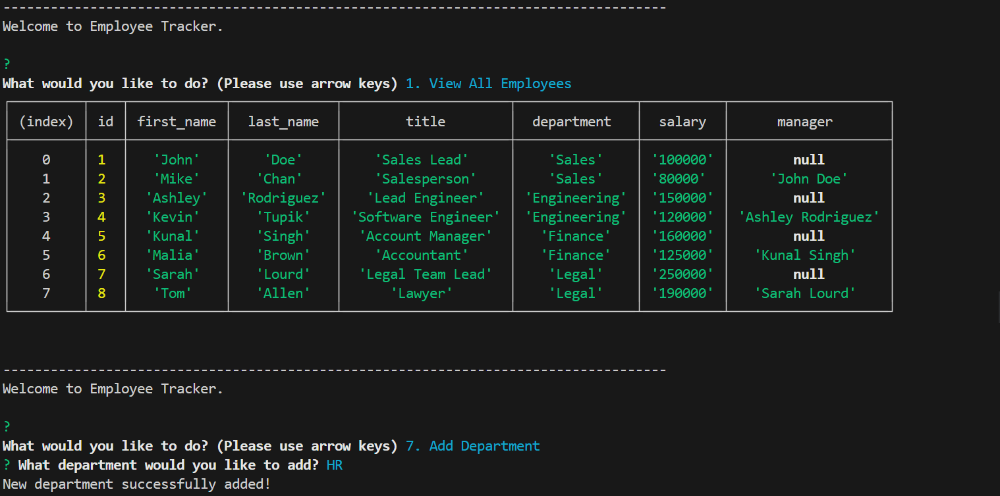
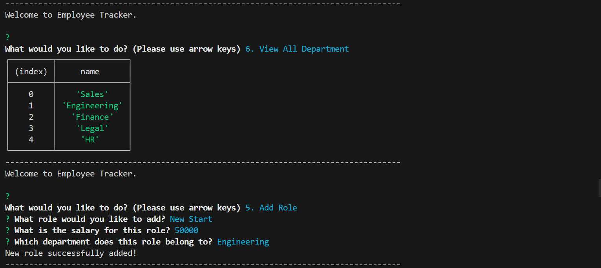
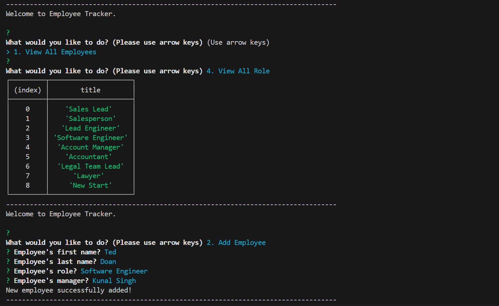
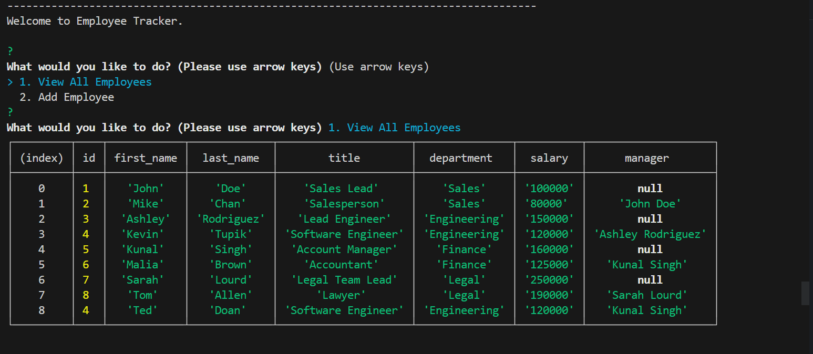
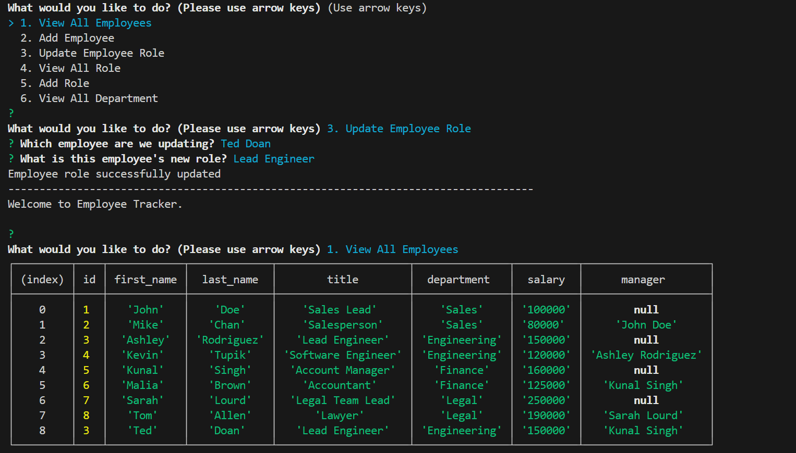

# Employee-Tracker

This is a command-line application to manage a company's employee database, using Node.js, Inquirer, and MySQL.

<br>

## Table of Contents

- [Description](#description)
- [Usage](#usage)
- [References](#references)
- [Links](#links)
- [Features](#features)
- [Installations](#installations)
- [User Story](#user-story)
- [Acceptance Criteria](#acceptance-criteria)

<br>

## Description

- This program will start with a menu and user can select from 8 options
- After each selection, program will generate/edit information and prompt user for another option

<br>

## Usage

- Use Mysql to run the schema and the seed SQL files
- Start the program with 'npm start'
  
  
  
  
  
  

<br>

## Links

- Github page: https://github.com/teddysm/Employee-Tracker
- Video walkthrough: [https://drive.google.com/file/d/1uj-EOwVwclUagV6Fe3fXSDA2Wu3r2tqS/view/](https://app.screencastify.com/manage/videos/MuiYre8Zaje3H612S9hl)

<br>

## Features

- User can view all employees, Add Employee, Update Employee Role, View All Role, Add Role, View All Department, and Add Department.

<br>

## Installations

- Users need to install MySQL2 to connect to MySQL database and perform queries, and the Inquirer package to interact with the user via the command line.

<br>

## User Story

```md
AS A business owner
I WANT to be able to view and manage the departments, roles, and employees in my company
SO THAT I can organize and plan my business
```

## Acceptance Criteria

```md
GIVEN a command-line application that accepts user input
WHEN I start the application
THEN I am presented with the following options: view all departments, view all roles, view all employees, add a department, add a role, add an employee, and update an employee role
WHEN I choose to view all departments
THEN I am presented with a formatted table showing department names and department ids
WHEN I choose to view all roles
THEN I am presented with the job title, role id, the department that role belongs to, and the salary for that role
WHEN I choose to view all employees
THEN I am presented with a formatted table showing employee data, including employee ids, first names, last names, job titles, departments, salaries, and managers that the employees report to
WHEN I choose to add a department
THEN I am prompted to enter the name of the department and that department is added to the database
WHEN I choose to add a role
THEN I am prompted to enter the name, salary, and department for the role and that role is added to the database
WHEN I choose to add an employee
THEN I am prompted to enter the employee’s first name, last name, role, and manager, and that employee is added to the database
WHEN I choose to update an employee role
THEN I am prompted to select an employee to update and their new role and this information is updated in the database
```
